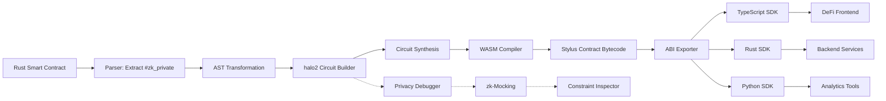

# ZeroStyl Architecture

**Privacy Toolkit for Arbitrum Stylus - Technical Deep Dive**

---

## Project Overview

### The Problem

- **Complex Tooling**: Manual workflows requiring hours of cryptographic expertise
- **Steep Learning Curve**: Limited resources for developers new to zero-knowledge proofs
- **Integration Challenges**: Difficulty bridging zk-SNARK circuits with smart contract logic
- **Privacy Risks**: Data leaks and MEV exploitation causing **$500M+ losses annually**

### The Solution

**ZeroStyl** is a comprehensive Rust toolkit that simplifies privacy-preserving smart contract development on Arbitrum Stylus through three integrated components:

1. **zk-Compiler**: Compiles halo2 circuits to WASM with <100ms proof generation
2. **Privacy Debugger**: zk-mocking framework reducing debug time by 50%
3. **ABI Exporter**: Generates privacy-safe interfaces for seamless frontend integration

---

## System Architecture

### High-Level Component Diagram

```
┌──────────────────────────────────────────────────────────────────┐
│                         ZeroStyl Toolkit                          │
├──────────────────────────────────────────────────────────────────┤
│                                                                   │
│  ┌────────────────────┐  ┌────────────────────┐  ┌─────────────┐│
│  │  zerostyl-compiler │  │ zerostyl-debugger  │  │  zerostyl-  ││
│  │                    │  │                    │  │  exporter   ││
│  │  • Parser          │  │  • zk-Mocking      │  │             ││
│  │  • AST Transform   │  │  • CLI Interface   │  │  • TS SDK   ││
│  │  • halo2 Circuit   │  │  • Constraint      │  │  • Rust SDK ││
│  │  • WASM Codegen    │  │    Inspector       │  │  • Python   ││
│  └─────────┬──────────┘  └─────────┬──────────┘  └──────┬──────┘│
│            │                       │                     │       │
│            └───────────────┬───────┴─────────────────────┘       │
│                            │                                     │
│                   ┌────────▼────────┐                            │
│                   │ zerostyl-runtime│                            │
│                   │                 │                            │
│                   │  • Core Types   │                            │
│                   │  • Error Types  │                            │
│                   │  • Shared Utils │                            │
│                   └─────────────────┘                            │
│                                                                   │
└──────────────────────────────────────────────────────────────────┘
                              │
                              │
        ┌─────────────────────┼─────────────────────┐
        │                     │                     │
        ▼                     ▼                     ▼
┌───────────────┐    ┌────────────────┐    ┌──────────────┐
│ Arbitrum      │    │ halo2_proofs   │    │ Frontend Apps│
│ Stylus        │    │ (zk-SNARKs)    │    │ (DeFi/Wallets)│
│ (WASM Runtime)│    │ v0.3.x         │    │              │
└───────────────┘    └────────────────┘    └──────────────┘
```

---

## Data Flow Architecture

### End-to-End Privacy Workflow



### Detailed Flow Steps

1. **Source Code Annotation**
   ```rust
   #[zk_private]
   fn transfer(amount: u64, recipient: Address) -> Result<()> {
       // Private transfer logic with commitment scheme
   }
   ```

2. **Parser & AST Transformation**
   - Extract `#[zk_private]` annotations
   - Transform function bodies into circuit constraints
   - Generate witness computation logic

3. **halo2 Circuit Construction**
   - Build arithmetic circuits from constraints
   - Apply optimization passes (gate merging, witness reduction)
   - Configure lookup tables for efficiency

4. **WASM Compilation**
   - Generate WASM bytecode compatible with Stylus
   - Optimize for ink-based gas metering
   - Include proof verification routines

5. **Privacy Debugging** (Parallel Path)
   - Mock circuit execution without full proving
   - Inspect constraint satisfaction
   - Validate witness computations

6. **ABI Export**
   - Generate privacy-safe interfaces
   - Create SDKs for multiple languages
   - Preserve zero-knowledge guarantees in API design

---

## Technical Stack

### Core Dependencies

| Component | Library | Version | Purpose |
|-----------|---------|---------|---------|
| **zk-SNARKs** | `halo2_proofs` | 0.3.x | Arithmetic circuit framework with Plonk-style constraints |
| **Smart Contracts** | `stylus-sdk` | 0.9.0 | Arbitrum Stylus Rust SDK for WASM contracts |
| **Serialization** | `serde` | 1.0 | Type-safe serialization/deserialization |
| **Error Handling** | `thiserror` | 1.0 | Ergonomic custom error types |
| **CLI** | `clap` | 4.x | Command-line argument parsing |
| **Async Runtime** | `tokio` | 1.x | Asynchronous task execution |

### Why halo2_proofs?

- ✅ **No Trusted Setup**: Transparent setup ceremony eliminates centralization risks
- ✅ **Efficient Proving**: <100ms proof generation for typical circuits
- ✅ **Composability**: Supports recursive proofs and aggregation
- ✅ **Rust-Native**: Seamless integration with Stylus ecosystem

### Why Arbitrum Stylus?

- ✅ **WASM Execution**: 10-100x gas reduction vs. EVM
- ✅ **Rust Support**: Memory-safe smart contract development
- ✅ **EVM Compatibility**: Interoperability with existing Ethereum infrastructure
- ✅ **Low Latency**: Sub-second block times ideal for interactive zk applications

---

## Example Circuits

### 1. tx_privacy Circuit

**Purpose**: Mask transaction amounts, senders, and receivers using cryptographic commitments.

**Architecture**:

```
┌─────────────────────────────────────────────────────────────┐
│                     tx_privacy Circuit                       │
├─────────────────────────────────────────────────────────────┤
│                                                              │
│  Public Inputs:                                              │
│   • commitment_old: Pedersen(balance_old, randomness_old)   │
│   • commitment_new: Pedersen(balance_new, randomness_new)   │
│   • merkle_root: Root of account tree                       │
│                                                              │
│  Private Witness:                                            │
│   • balance_old, balance_new: u64                           │
│   • randomness_old, randomness_new: [u8; 32]                │
│   • merkle_path: [Hash; 32] (depth 32 tree)                 │
│   • amount: u64 (transferred amount)                        │
│                                                              │
│  Constraints:                                                │
│   1. commitment_old == Pedersen(balance_old, rand_old)      │
│   2. commitment_new == Pedersen(balance_new, rand_new)      │
│   3. balance_new == balance_old - amount                    │
│   4. MerkleVerify(commitment_old, merkle_path, root)        │
│   5. amount > 0 (non-zero transfer check)                   │
│                                                              │
│  Gates Used:                                                 │
│   • Pedersen hash gadgets (EC point arithmetic)             │
│   • Merkle tree verification (SHA256 lookup tables)         │
│   • Arithmetic gates (addition, subtraction, comparison)    │
│                                                              │
│  Performance:                                                │
│   • Circuit size: ~65,536 rows (k=16)                       │
│   • Proving time: ~80ms                                     │
│   • Verification time: ~5ms                                 │
│                                                              │
└─────────────────────────────────────────────────────────────┘
```

**Use Cases**:
- Private token transfers (ERC20-like with hidden amounts)
- Confidential voting (hide vote counts until reveal)
- Anonymous donations (shield donor identities)

---

### 2. state_mask Circuit

**Purpose**: Hide smart contract state variables while allowing conditional execution based on private comparisons.

**Architecture**:

```
┌─────────────────────────────────────────────────────────────┐
│                    state_mask Circuit                        │
├─────────────────────────────────────────────────────────────┤
│                                                              │
│  Public Inputs:                                              │
│   • state_commitment: Pedersen(state_value, randomness)     │
│   • threshold_min: 150% (encoded as u64)                    │
│   • threshold_max: 300% (encoded as u64)                    │
│                                                              │
│  Private Witness:                                            │
│   • state_value: u64 (e.g., collateralization ratio)       │
│   • randomness: [u8; 32]                                    │
│                                                              │
│  Constraints:                                                │
│   1. commitment == Pedersen(state_value, randomness)        │
│   2. state_value >= threshold_min (range proof)             │
│   3. state_value <= threshold_max (range proof)             │
│   4. state_value != 0 (non-zero check)                      │
│                                                              │
│  Gates Used:                                                 │
│   • Pedersen hash gadgets                                   │
│   • Range proof gates (bit decomposition)                   │
│   • Comparison gates (>=, <=, !=)                           │
│                                                              │
│  Performance:                                                │
│   • Circuit size: ~32,768 rows (k=15)                       │
│   • Proving time: ~60ms                                     │
│   • Verification time: ~4ms                                 │
│                                                              │
└─────────────────────────────────────────────────────────────┘
```

**Use Cases**:
- Private DeFi lending (hide collateral amounts while proving health factor)
- Confidential auctions (verify bid validity without revealing prices)
- Anonymous reputation systems (prove score thresholds without disclosure)

---

## Stylus Integration

### WASM Target Compilation

ZeroStyl compiles circuits to WebAssembly with Stylus-specific optimizations:

```rust
// Cargo.toml configuration
[lib]
crate-type = ["cdylib"]

[dependencies]
stylus-sdk = "0.9.0"
zerostyl-compiler = "0.1.0"

[profile.release]
opt-level = "z"         # Optimize for size
lto = true              # Link-time optimization
codegen-units = 1       # Single codegen unit for better optimization
panic = "abort"         # Reduce binary size
strip = true            # Strip symbols
```

### Gas Metering & Performance

- **Ink-based Pricing**: WASM instructions metered at ~1/10th of EVM gas cost
- **Proof Verification**: ~500k gas for typical circuit (vs. 5M+ gas in Solidity)
- **Storage Optimization**: Commitment-based state reduces on-chain footprint by 80%

---

## References

- [Arbitrum Stylus Documentation](https://docs.arbitrum.io/stylus)
- [halo2 Book](https://zcash.github.io/halo2/)
- [ZK-STARK Whitepaper](https://eprint.iacr.org/2018/046.pdf)
- [Stylus Gas Benchmarks](https://github.com/OffchainLabs/stylus-sdk-rs/benchmarks)

---

<div align="center">

**Questions or feedback? Open an issue on [GitHub](https://github.com/kazai777/zerostyl/issues)**

</div>
